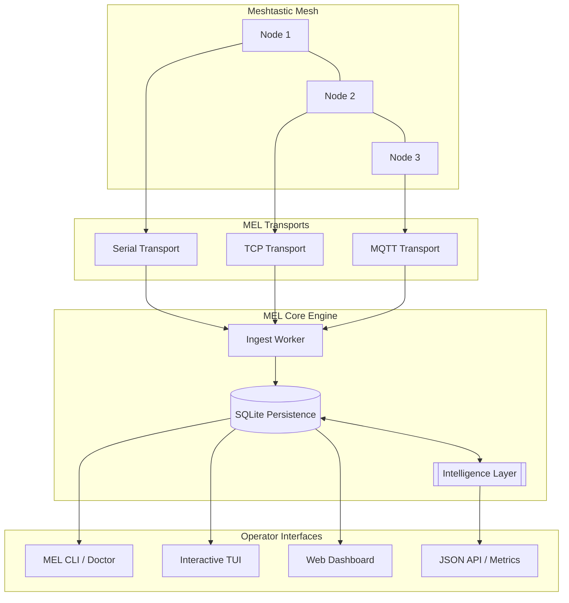

# MEL — MeshEdgeLayer

**Truthful, local-first mesh observability and operator control plane for Meshtastic.**


[](https://goreportcard.com/report/github.com/mel-project/mel)
[](LICENSE)
[](docs/roadmap/ROADMAP_EXECUTION.md)

[Quickstart](#quickstart) • [Architecture](#architecture) • [Documentation](docs/README.md) • [Contributing](CONTRIBUTING.md)

---

## What is MEL?

MEL is a heavy-duty ingest, persistence, and observability layer designed for **production-oriented Meshtastic deployments**. It provides operators with high-fidelity visibility into mesh health, packet traffic, and node telemetry without relying on cloud services or external dependencies.

Unlike generic dashboards, MEL is built on a "Truth First" philosophy: it only reports data it has successfully persisted and verified in its local state.

### Core Capabilities

- **Multi-Transport Ingest**: Simultaneous support for Serial-direct, TCP-direct, and MQTT transports.
- **Relentless Persistence**: Deterministic SQLite storage with audit logging and dead-letter handling.
- **Operator Observability**: authoritative CLI (`mel doctor`), a real-time TUI, and a modern Web Dashboard.
- **Privacy by Design**: Built-in redaction, privacy audits, and local-first data ownership.
- **Guarded Remediation**: A sophisticated [Control Plane](docs/architecture/control-plane.md) that can suggest or execute mesh-tuning actions safely.

---

## Architecture

MEL follows a unidirectional data flow to ensure integrity and determinism.



Learn more about the [**Intelligence Layer**](docs/architecture/intelligence-layer.md) and [**Control Plane**](docs/architecture/control-plane.md).

---

## Quickstart

MEL is designed to be up and running in under 5 minutes.

### 1. Installation

**Linux / macOS:**

```bash
curl -sSL https://mel.sh/install.sh | sh
```

**Windows (PowerShell):**

```powershell
iwr https://mel.sh/install.ps1 | iex
```

*Or build from source:* `go build -o mel ./cmd/mel`

### 2. Initialize and Validate

```bash
mel init
mel doctor
```

### 3. Start the Control Plane

```bash
mel serve --config mel.json
```

Visit **<http://localhost:8080>** to see your mesh come alive.

---

## Supported Transports

| Transport | Status | Verification |
| :--- | :--- | :--- |
| **Serial Direct-Node** | ✅ Supported | `mel doctor`, `mel status`, Web UI |
| **TCP Direct-Node** | ✅ Supported | `mel doctor`, `mel status`, Web UI |
| **MQTT Ingest** | ✅ Supported | `mel status`, Web UI, `/metrics` |
| **BLE / HTTP** | ❌ Unsupported | N/A |

---

## The MEL Philosophy: Zero Theatre

- **No Fake Data**: If you see it in MEL, it happened on the wire.
- **No Silent Failures**: Transports report explicit states (e.g., `connected_no_ingest`, `ingesting`).
- **No Dependencies Bloat**: Built with Go stdlib and minimalist primitives.
- **No Magic**: Every decision the Control Plane makes is explainable and auditable.

---

## Documentation

- [**Getting Started**](docs/getting-started/README.md) - Full setup and first 10 minutes.
- [**Architecture**](docs/architecture/overview.md) - Deep dive into subsystems.
- [**Operator Guide**](docs/ops/README.md) - Running MEL in production.
- [**API Reference**](docs/ops/api-reference.md) - Integrating with MEL.
- [**CLI Control**](docs/ops/control-cli.md) - Direct Control Plane operations.

---

## Contributing

We welcome contributions that increase structural coherence and reduce entropy. See [CONTRIBUTING.md](CONTRIBUTING.md) for guidelines.

MEL is licensed under the **Apache-2.0 License**.
