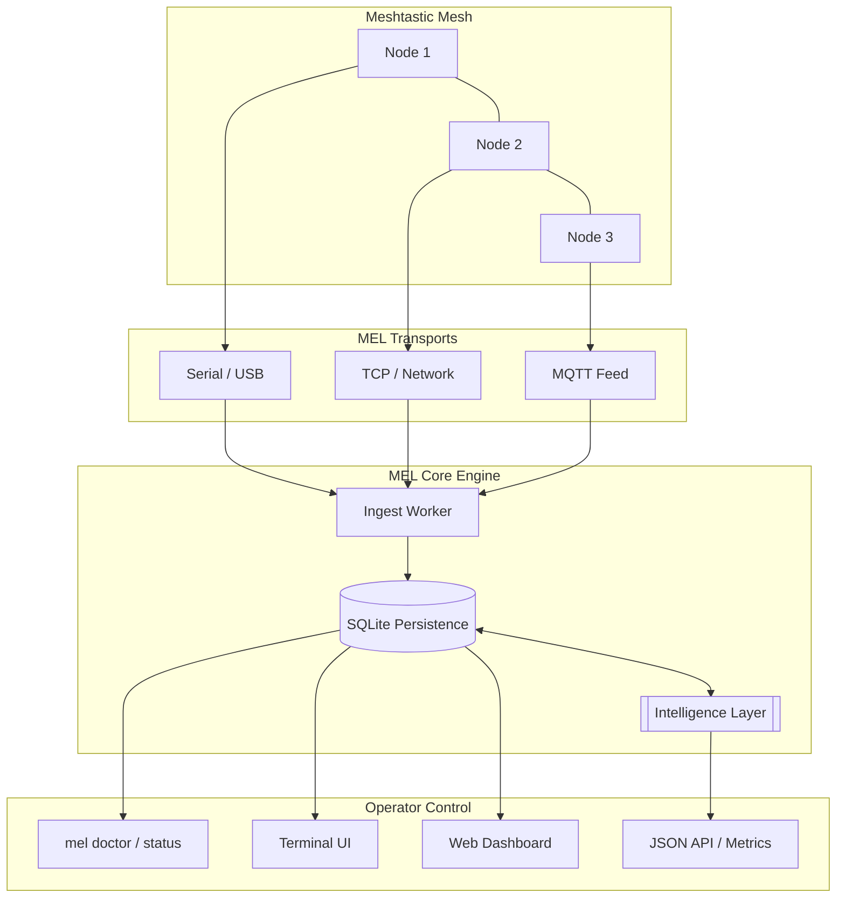

# MEL — MeshEdgeLayer

**Truthful, local-first mesh observability and operator control plane for Meshtastic.**


[](https://goreportcard.com/report/github.com/mel-project/mel)
[](LICENSE)
[](docs/roadmap/ROADMAP_EXECUTION.md)

[Quickstart](#quickstart-under-5-minutes) • [Architecture](#how-it-works) • [Documentation](docs/README.md) • [Contributing](CONTRIBUTING.md)

---

## What is MEL?

MEL is a heavy-duty ingest, persistence, and observability layer designed for **production-oriented Meshtastic deployments**. It provides operators with high-fidelity visibility into mesh health, packet traffic, and node telemetry without relying on cloud services or external dependencies.

Unlike generic dashboards, MEL is built on a **"Truth First" Philosophy**: it only reports data it has successfully persisted and verified in its local state. If MEL says it happened, it happened on the wire.

### Why MEL?

- **The "Black Box" Problem**: Generic mesh dashboards often hide transport failures or invent "healthy" traffic. MEL makes every degraded state explicit.
- **Operator Ownership**: Your mesh data belongs in your SQLite database, not a third-party cloud.
- **Relentless Persistence**: Every packet is checked, classified, and stored with an audit trail.
- **Guarded Automation**: MEL doesn't just watch; its [Control Plane](docs/architecture/control-plane.md) suggests and executes safe remediation to keep your mesh alive.

---

## Key Core Capabilities

- **Multi-Transport Ingest**: Simultaneous support for **Serial (USB)**, **TCP (Network)**, and **MQTT** transports.
- **Authoritative Diagnostics**: Run `mel doctor` to verify host permissions, database integrity, and transport health in seconds.
- **Modern Operator UI**: A sleek, real-time Web Dashboard and a responsive TUI for field operations.
- **Intelligence Layer**: Deep packet inspection that classifies traffic into `text`, `position`, `node_info`, and `telemetry` with raw fallbacks.
- **Privacy by Design**: Built-in redaction, privacy audits, and local-only position storage by default.

---

## Quickstart (Under 5 Minutes)

MEL is designed to be up and running before your next packet arrives.

### 1. Install MEL

**Linux / macOS / Windows (Go 1.24+ per `go.mod`):**

```bash
go build -o mel ./cmd/mel
```

*(Pre-built binaries coming soon to [Releases](https://github.com/mel-project/mel/releases))*

### 2. Initialize and Validate

```bash
# Generate a fresh operator config
./mel init --config configs/mel.json

# Create data directories, apply SQLite migrations, validate (no serve yet)
./mel bootstrap run --config configs/mel.json

# Run a pre-flight health check (config, schema parity, audit chain, transports)
./mel doctor --config configs/mel.json

# Optional: same checks + HTTP probe of bind.api /healthz and explicit next steps (JSON)
./mel preflight --config configs/mel.json

# Optional: upgrade readiness + audit chain proof
./mel upgrade preflight --config configs/mel.json
./mel audit verify --config configs/mel.json
```

Deployment-oriented examples (systemd, env, Docker) live under `examples/deployment/`.

### 3. Launch the Control Plane

```bash
# Start the ingest engine and web dashboard
./mel serve --config configs/mel.json
```

Visit **[http://localhost:8080](http://localhost:8080)** to see your mesh come alive.

---

## How it Works

MEL follows a unidirectional, guarded data flow to ensure integrity.



---

## 5-Minute Tour

1. **Inspect Health**: Use `mel status` to see live transport scores.
2. **Verify Reachability**: Run `mel doctor` to ensure your serial devices and databases are writable.
3. **Monitor Ingest**: Tail the audit logs with `./mel logs tail`.
4. **Explore Nodes**: Visit the Web UI `/nodes` page to see the latest telemetry from across the mesh.
5. **Audit Privacy**: Run `mel privacy audit` to check for unintended location leaks.

---

## Zero-Theatre Policy

- **No Fake Data**: 0 messages means 0 messages. We do not interpolate or guess.
- **No Silent Failures**: If a serial port is busy, you get a critical finding with remediation guidance.
- **No Magic**: Every decision the Control Plane makes is grounded in the **Reality Matrix** and explained in plain English.
- **No Bundle Bloat**: Minimalist Go implementation with near-zero external dependencies.

---

## Contributing

We welcome contributions that increase structural coherence and reduce entropy.

- **Bug Reports**: Open a [Bug Report](https://github.com/mel-project/mel/issues/new?template=bug_report.md).
- **New Transports**: See our [Transport Implementation Guide](docs/contributor/adding-transports.md).
- **Code Guidelines**: Read [CONTRIBUTING.md](CONTRIBUTING.md).

MEL is licensed under the **Apache-2.0 License**.
© 2026 Hardonian / MeshEdgeLayer Contributors.
