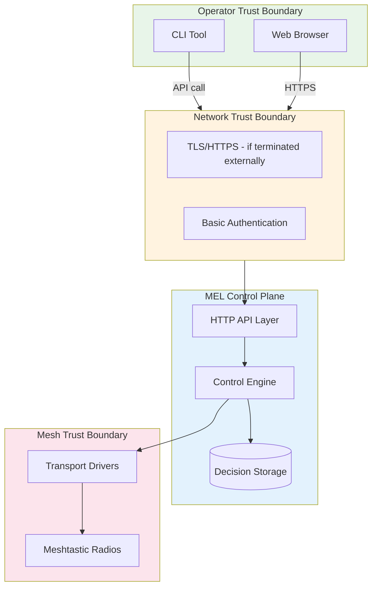

# MEL Control Plane Trust Model

**Version:** 1.0  
**Date:** March 2026  
**Status:** Canonical Definition

This document defines the trust assumptions, boundaries, and guarantees for the MEL control plane—the component that evaluates mesh health and makes or recommends remediation actions.

---

## Executive Summary

The MEL control plane operates under a defense-in-depth trust model:

1. **Observability trust:** MEL trusts its observations of mesh traffic and transport state
2. **Inference skepticism:** MEL maintains skepticism about its own inferences, using confidence scoring
3. **Action conservatism:** MEL defaults to advisory-only actions unless explicitly configured otherwise
4. **Operator supremacy:** Human operators can override any automated decision
5. **Evidence preservation:** All decisions are logged with their supporting evidence

---

## Operator Trust Surfaces

### Direct Control Surfaces

| Surface | Trust Level | Authentication | Authorization |
| --------- | ------------- | ---------------- | --------------- |
| CLI (local) | High | OS filesystem permissions | OS user context |
| CLI (remote via API) | Medium | Basic Auth ([`internal/web/web.go`](internal/web/web.go:853)) | Single shared credential |
| Web UI | Medium | Basic Auth | Single shared credential |
| API direct | Medium | Basic Auth | Single shared credential |
| Config file | High | OS filesystem permissions | OS user context |

### Trust Boundaries



### Operator identity and API keys (current)

**UI (Basic auth):** One shared `ui_user` / `ui_password` receives the **full capability superset** enforced by [`internal/security/security.go`](../../internal/security/security.go) and [`internal/web/web.go`](../../internal/web/web.go) (`BuildAdminIdentity`).

**API keys (`X-API-Key`):** When `auth.enabled`, keys are loaded from `auth.operator_keys` (explicit `capabilities` per key) and/or from environment (`MEL_AUTH_API_KEYS`, optional `auth.api_keys_env`). Keys that appear **only** in the environment receive the same **full-admin capability superset** as today (explicit break-glass compatibility). If the same key material is listed in `auth.operator_keys`, the JSON entry wins and env does not widen it.

**Capabilities** are the authorization source of truth (not decorative role labels). Examples: `read_status`, `read_incidents`, `read_actions`, `approve_control_action`, `reject_control_action`, `execute_control_action`, `incident_handoff_write`, `incident_update`, plus existing alert/export/config caps. HTTP handlers use [`security.Require` / `RequireAny`](../../internal/security/security.go).

**CLI (local):** Filesystem access to the config and SQLite still implies full mutability for OS users; `mel control approve|reject` is **legacy break-glass** and requires `--i-understand-break-glass-sod`. It invokes the same service-layer approve/reject as `mel action` (audit_log, timeline, executor queue) and stamps durable `metadata_json` break-glass fields. Prefer `mel action approve|reject` for normal operations.

**Remaining limitations:** No maker-checker / separation of duties; `X-Operator-ID` is an audit hint, not a second authentication factor.

---

## Evidence Trust Model

### Evidence Hierarchy

| Evidence Type | Trust Level | Source | Validation |
| --------------- | ------------- | -------- | ------------ |
| Raw packet bytes | Highest | Transport driver | Checksum verification |
| Decoded protobuf | High | Protobuf library | Schema validation |
| Transport state | High | State machine | State transition logging |
| Derived metrics | Medium | Aggregation logic | Cross-reference check |
| Inferred health | Medium | Heuristics | Confidence scoring |
| Pattern matches | Lower | Pattern engine | Manual verification |

### Evidence Preservation

MEL preserves evidence through multiple mechanisms:

1. **Dead letters** ([`internal/db/db.go`](internal/db/db.go:54)): Failed packets stored with reason
2. **Audit logs** ([`internal/db/db.go`](internal/db/db.go:1)): All significant events logged
3. **Transport snapshots** ([`migrations/0007_transport_intelligence.sql`](migrations/0007_transport_intelligence.sql:1)): Periodic state capture
4. **Anomaly records** ([`internal/db/transport_intelligence.go`](internal/db/transport_intelligence.go:1)): Detected patterns stored
5. **Control decisions** ([`migrations/0010_guarded_control.sql`](migrations/0010_guarded_control.sql:1)): Decision context preserved

### Evidence Corruption Risks

| Risk | Mitigation | Detection |
| ------ | ------------ | ----------- |
| Database corruption | SQLite integrity checks | `PRAGMA integrity_check` |
| Log tampering | Append-only design | Chain of hashes (future) |
| Clock manipulation | NTP recommended | Monotonic clock checks |
| Replay attacks | Episode IDs | Timestamp validation |

---

## Action Trust Model

### Action Classification

| Action Type | Trust Required | Reversibility | Blast Radius |
| ------------- | ---------------- | --------------- | -------------- |
| `restart_transport` | Medium | Yes (restarts are bounded) | Single transport |
| `resubscribe_transport` | Medium | Yes | Single transport |
| `backoff_increase` | Low | Yes (can reset) | Single transport |
| `backoff_reset` | Low | N/A (recovery action) | Single transport |
| `trigger_health_recheck` | Low | N/A (read-only) | Local process |
| `temporarily_deprioritize_transport` | High | Partial | Mesh routing |
| `temporarily_suppress_noisy_source` | High | Partial | Node visibility |
| `clear_suppression` | Medium | N/A (recovery action) | Node visibility |

### Action Reality Check

The [`control_action_reality`](migrations/0011_control_closure.sql:13) table explicitly tracks:

- Whether an actuator exists for each action
- Whether the action is reversible
- Whether blast radius is known and bounded
- Whether the action is safe for `guarded_auto` mode

**Current Reality:**

- 5 actions have working actuators
- 3 actions are advisory-only (no actuators shipped)
- All reversible actions have expiry mechanisms

### Safety Check Enforcement

Before executing any action, MEL validates ([`internal/control/control.go`](internal/control/control.go:77)):

1. **Evidence pass:** ≥2 time buckets of anomaly data
2. **Confidence pass:** Score >= `require_min_confidence`
3. **Policy pass:** Action in `allowed_actions` list
4. **Cooldown pass:** Target not in cooldown window
5. **Budget pass:** Window action count < `max_actions_per_window`
6. **Conflict pass:** No conflicting action in flight
7. **Reversibility pass:** Action reversible OR has expiry
8. **Blast radius pass:** Blast radius known and bounded
9. **Actuator pass:** Working actuator exists
10. **Alternate path pass:** For deprioritize, healthy alternate exists

**Trust Model:** All checks must pass for execution in `guarded_auto` mode.

### Denial Codes and Trust

When an action is denied, the denial code ([`internal/control/control.go`](internal/control/control.go:63)) indicates:

| Code | Trust Implication |
| ------ | ------------------- |
| `policy` | Operator policy configuration prevents action |
| `mode` | Control mode not set to execute |
| `cooldown` | Rate limiting protecting target |
| `budget` | Global rate limiting active |
| `low_confidence` | Insufficient evidence to act |
| `missing_actuator` | Cannot execute (theatre detection) |
| `unknown_blast_radius` | Safety unknown, conservatively denied |
| `attribution_weak` | Cannot confirm target identity |

---

## Audit Integrity Expectations

### Audit Scope

MEL audits the following events:

- All control decisions (allowed and denied)
- All control action executions
- Transport state changes
- Configuration changes (via API)
- Security events (auth failures)
- Privacy-affecting operations

### Audit Record Structure

```go
// From internal/db/db.go
AuditLog {
    Category    string      // Component (transport, control, security)
    Level       string      // Severity
    Message     string      // Human-readable
    Details     JSON        // Structured data
    CreatedAt   timestamp   // Event time
}
```

### Audit Integrity Properties

| Property | Current | Target |
| ---------- | --------- | -------- |
| Append-only | Yes | Yes |
| Tamper-evident | No | Hash chain (Phase 6) |
| Immutable | Soft (can prune) | Hard (configurable retention) |
| Queryable | Yes | Yes |
| Exportable | Yes | Yes (with redaction) |

### Audit Limitations

**Current gaps:**

- No cryptographic integrity protection
- Can be pruned by retention policy
- No external attestation
- Operator identity not always captured

**Planned improvements:** Phase 6 of PRODUCTION_CLOSURE_ROADMAP.md

---

## Export/Support Trust Guarantees and Limits

### Support Bundle Contents

Generated by [`internal/support/support.go`](internal/support/support.go:28):

| Content | Trust Level | Redaction |
| --------- | ------------- | ----------- |
| Config | High | Secrets removed |
| Diagnostics | High | May include sensitive paths |
| Nodes | High | Position precision reduced |
| Messages | Medium | Payload optionally redacted |
| Dead letters | High | Payload preserved for debugging |
| Audit logs | High | All events included |

### Privacy Guarantees

When `privacy.redact_exports` is true:

- Payloads replaced with `[redacted]`
- Config secrets removed
- Position precision reduced

**Trust Limitation:** Redaction is best-effort. Review bundles before sharing.

### Export Verification

Operators should verify:

1. Bundle generated from expected MEL instance
2. Timestamp matches expectation
3. No unexpected sensitive data present
4. Integrity of ZIP structure

**Trust Boundary:** MEL cannot prevent operator error in bundle handling.

---

## Shared-Use Safety Assumptions

### Single-Tenant Assumption

**Current State:** MEL assumes single-tenant operation:

- No data isolation between users
- No per-user views
- No resource quotas

**Implication:** Multi-operator use requires:

- Mutual trust between operators
- Shared responsibility for actions
- External coordination for changes

### Network Security Assumptions

MEL assumes:

- Localhost binding for sensitive operations
- External TLS termination if exposed
- VPN or private network for remote access
- Firewall rules restrict access appropriately

**Violation Risk:** If MEL is exposed to untrusted networks:

- Basic auth vulnerable to brute force
- No rate limiting on all endpoints
- Potential for data exposure

### Data Sovereignty Assumptions

MEL assumes:

- Operator owns the data
- Local storage is acceptable
- No data residency requirements
- Backup responsibility lies with operator

---

## Threat Scenarios and Trust Response

### Scenario 1: Compromised Operator Account

**Threat:** Attacker gains API credentials

**Impact:**

- Can view all data
- Can trigger control actions
- Can modify configuration

**Mitigation:**

- Use localhost binding
- Rotate credentials regularly
- Enable audit logging
- Monitor for unusual patterns

**Recovery:**

- Change credentials
- Review audit logs
- Restore from known-good backup if needed

### Scenario 2: Malicious Mesh Traffic

**Threat:** Attacker sends crafted packets

**Impact:**

- Potential decode failures
- Dead letter creation
- False anomaly detection

**Mitigation:**

- Input validation
- Dead letter isolation
- Anomaly confidence scoring

**Trust Boundary:** MEL is read-only; cannot be used to attack mesh

### Scenario 3: Database Tampering

**Threat:** Attacker modifies SQLite directly

**Impact:**

- Audit log integrity compromised
- False control history
- Data corruption

**Mitigation:**

- Filesystem permissions
- Backup integrity
- Future: Cryptographic audit signing

**Detection:**

- Anomaly detection on data patterns
- Cross-reference with transport state

### Scenario 4: Control Plane Runaway

**Threat:** MEL takes excessive actions

**Impact:**

- Transport flapping
- Unnecessary reconnections
- Alert fatigue

**Mitigation:**

- Action budgets
- Cooldown periods
- Emergency disable switch
- Advisory mode default

**Recovery:**

- Set `control.emergency_disable: true`
- Restart MEL
- Review decision history

---

## Trust Verification Checklist

For operators validating control plane trustworthiness:

### Pre-Deployment

- [ ] Review `control.mode` setting (default: advisory)
- [ ] Verify `allowed_actions` list
- [ ] Confirm confidence thresholds
- [ ] Review safety check documentation
- [ ] Understand action reversibility

### During Operation

- [ ] Monitor control decision logs
- [ ] Review denied action patterns
- [ ] Verify evidence quality
- [ ] Check audit log integrity
- [ ] Test emergency disable

### Incident Response

- [ ] Access control history
- [ ] Correlate actions with evidence
- [ ] Verify decision rationale
- [ ] Export audit trail
- [ ] Document lessons learned

---

## Trust Model Evolution

| Phase | Trust Improvement |
| ------- | ------------------- |
| Phase 1 | Operator identity and attribution |
| Phase 4 | Alert acknowledgment (human in loop) |
| Phase 5 | More executable actions with safeguards |
| Phase 6 | Audit integrity via hash chain |
| Phase 9 | Self-monitoring and SLO alerts |

---

## Related Documents

- PRODUCTION_MATURITY_MATRIX.md - Capability assessment
- PRODUCTION_CLOSURE_ROADMAP.md - Improvement timeline
- OPERATIONAL_BOUNDARIES.md - System boundaries
- docs/ops/control-plane.md - Operator guide
- docs/threat-model/README.md - Security threats
