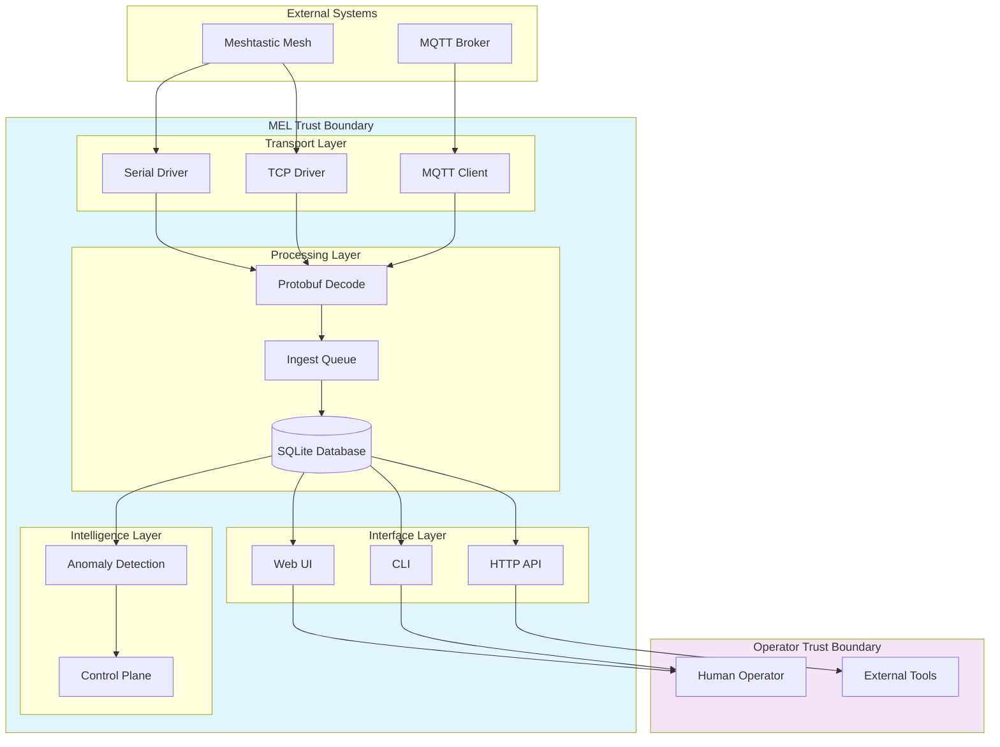

# MEL Operational Boundaries

**Version:** 1.0  
**Date:** March 2026  
**Status:** Canonical Definition

This document defines what MEL treats as truth, what it infers, and the explicit limits of its guarantees. It is the operational contract between MEL and its operators.

---

## What MEL Treats as Observed Truth

Observed truth is data that MEL has directly measured from mesh traffic or transport state. These are facts MEL will stake its reputation on, with appropriate confidence qualifiers.

### Transport-Level Observations

| Observation | Source | Confidence |
|-------------|--------|------------|
| Packet received | Raw bytes from transport | High - exact content captured |
| Timestamp of receipt | System clock at ingestion | High - millisecond precision |
| Transport state transition | Transport driver state machine | High - explicit state changes logged |
| Connection attempt | Network syscall result | High - success/failure binary |
| Reconnect count | Internal counter | High - exact count maintained |
| Timeout occurrence | Timer expiry | High - explicit timeout handling |
| Dead letter created | Processing failure | High - failure path always captured |

### Mesh-Level Observations

| Observation | Source | Confidence |
|-------------|--------|------------|
| Node ID seen in packet | Decoded protobuf | High - explicit field extraction |
| Packet type (portnum) | Decoded protobuf | High - enum value captured |
| RX time reported | Gateway timestamp or local clock | Medium - depends on gateway clock sync |
| Gateway ID | Packet metadata | High - explicit field extraction |
| Payload bytes | Raw packet content | High - exact bytes stored |

### Storage Guarantees

When MEL reports data as "stored":
- Data has been written to SQLite
- Write was confirmed via `fsync` (via SQLite WAL)
- Data is queryable via SQL
- Data survives process restart

**Boundary:** MEL does not guarantee data survival in the following conditions:
- Filesystem corruption
- Disk failure
- Manual database deletion
- Storage device full (writes fail gracefully with errors)

---

## What MEL Infers

Inferred data is derived from observations through logic, heuristics, or aggregation. Inferences are labeled with confidence levels.

### Health Inferences

| Inference | Logic | Confidence |
|-----------|-------|------------|
| Transport "healthy" | Heartbeat within threshold AND no recent errors | Medium - depends on threshold appropriateness |
| Transport "degraded" | Timeout pattern OR error rate elevation | Medium - may lag actual condition |
| Transport "failed" | Terminal state OR retry threshold exceeded | High - explicit state machine outcome |
| Mesh "partitioned" | No cross-traffic between node groups | Low - may be normal silence |

### Node Inferences

| Inference | Logic | Confidence |
|-----------|-------|------------|
| Node "active" | Packet seen within window | Medium - silent nodes may still be active |
| Node "offline" | No packets beyond timeout threshold | Low - may be network path issue |
| Node position | Last reported position | High for timestamp, Medium for accuracy |
| Node role | Heuristic from behavior patterns | Low - explicitly labeled when known |

### Anomaly Inferences

| Inference | Logic | Confidence |
|-----------|-------|------------|
| "Noisy source" | Message rate above baseline | Medium - baseline may be wrong |
| "Degraded segment" | Multiple transport health issues | Medium - correlation not causation |
| "Retry storm" | Reconnect pattern analysis | High - explicit threshold breach |
| "Duplicate detection" | Content hash match | High - hash collision unlikely |

### Confidence Score Mapping

MEL uses explicit confidence scores in control decisions:

| Label | Score Range | Meaning |
|-------|-------------|---------|
| High | 0.90 - 1.00 | Multiple corroborating observations, strong evidence |
| Medium | 0.75 - 0.89 | Single strong observation or multiple weak |
| Low | 0.50 - 0.74 | Limited evidence, pattern match only |
| Insufficient | < 0.50 | Not actionable for control decisions |

**Boundary:** Confidence scores are calibrated heuristics, not statistical probabilities. They encode engineering judgment about evidence strength.

---

## What Confidence/Uncertainty Means

### Explicit Uncertainty Cases

MEL explicitly marks data as uncertain when:

1. **Clock Skew:** Multiple gateways with unsynchronized clocks
2. **Indirect Observation:** Node seen via relay, not directly
3. **Derived Metrics:** Aggregated statistics over variable sample sizes
4. **Pattern Matching:** Heuristic classification without ground truth
5. **Missing Context:** Packet received without full protocol decode

### Uncertainty Propagation

When MEL produces derived data, uncertainty propagates:

```
Observation A (High confidence) + Observation B (Medium confidence)
  → Inference C (Medium confidence)
```

The minimum confidence bound typically governs.

### Explicit Uncertainty in Control Decisions

Control actions ([`internal/control/control.go`](internal/control/control.go:1)) include:
- Confidence score in decision record
- Trigger evidence list
- Denial code if confidence insufficient

**Boundary:** MEL does not take `guarded_auto` actions below configured confidence threshold (default 0.75).

---

## What Actions MEL May Recommend vs Actually Execute

### Action Reality Matrix

| Action | Recommendable | Executable | Notes |
|--------|---------------|------------|-------|
| `restart_transport` | Yes | Yes | Bounded retry logic implemented |
| `resubscribe_transport` | Yes | Yes | MQTT only, explicit unsubscribe/resubscribe |
| `backoff_increase` | Yes | Yes | Exponential backoff in transport driver |
| `backoff_reset` | Yes | Yes | Clears backoff state |
| `trigger_health_recheck` | Yes | Yes | Async diagnostic run |
| `temporarily_deprioritize_transport` | Yes | No | No routing selector actuator |
| `temporarily_suppress_noisy_source` | Yes | No | No suppression actuator or metrics path |
| `clear_suppression` | Yes | No | No suppression state to clear |

### Execution Preconditions

For an action to execute (not just recommend), ALL must be true:

1. **Mode:** `control.mode` = `guarded_auto`
2. **Policy:** Action in `allowed_actions` list
3. **Confidence:** Score >= `require_min_confidence`
4. **Budget:** Within `max_actions_per_window`
5. **Cooldown:** `cooldown_per_target_seconds` elapsed
6. **Actuator:** Implementation exists and is not advisory-only
7. **Safety:** All safety checks pass (reversibility, blast radius, conflict)

### Execution Safeguards

Even when executable, actions have:
- Maximum execution time (`action_timeout_seconds`)
- Automatic expiry for temporary actions
- Conflict detection (no concurrent actions on same target)
- Rollback capability for reversible actions

**Boundary:** MEL never executes actions that are:
- Irreversible without manual intervention
- Affecting mesh-wide routing (unless `allow_mesh_level_actions`)
- Targeting nodes directly (transport-level only)

---

## What Deployment Modes Are Supported

### Validated Deployment Topologies

| Topology | Status | Notes |
|----------|--------|-------|
| Single-node, single-transport | Validated | Primary supported configuration |
| Single-node, MQTT only | Validated | Most common cloud-adjacent setup |
| Single-node, serial direct | Hardware-tested | Raspberry Pi + RAK Wisblock |
| Single-node, TCP direct | Code-tested | Meshtastic TCP API |
| Single-node, hybrid MQTT+direct | Documented | Dedupe requires operator verification |
| Multi-node, distributed | Not validated | No federation tested |
| Kubernetes, single replica | Not validated | Should work, not tested |
| High availability | Not supported | Single-node architecture |

### Platform Support Boundaries

| Platform | Support Level | Notes |
|----------|---------------|-------|
| Linux amd64 | Tier 1 | Primary development target |
| Linux arm64 | Tier 1 | Raspberry Pi primary use case |
| Raspberry Pi OS | Tier 1 | Documented, tested |
| Termux/Android | Tier 2 | Development/testing only |
| macOS | Tier 3 | Should work, not tested |
| Windows | Not supported | No native support |

### Transport Support Boundaries

| Transport | Ingest | Send | Config | Health | Notes |
|-----------|--------|------|--------|--------|-------|
| MQTT | Yes | No | No | Yes | Subscribe only, no publish |
| Serial | Yes | No | No | Yes | Hardware verified on Pi |
| TCP | Yes | No | No | Yes | Code verified, limited hardware testing |
| BLE | No | No | No | No | Explicitly unsupported |
| HTTP | No | No | No | No | Explicitly unsupported |

**Boundary:** MEL is strictly an observability system. It does not:
- Send messages to mesh
- Configure radios
- Update firmware
- Administer nodes

---

## What the System Does NOT Guarantee

### Explicit Non-Guarantees

1. **100% Message Capture:** MEL can lose messages due to:
   - Transport buffer overflow
   - Process restart during ingestion
   - Database write failure
   - Resource exhaustion

2. **Real-Time Delivery:** MEL does not guarantee:
   - Sub-second latency
   - Ordered delivery across transports
   - Synchronous acknowledgment

3. **Perfect Clock Synchronization:** MEL relies on:
   - Local system clock
   - Gateway-reported timestamps
   - No NTP verification

4. **Mesh Topology Accuracy:** MEL observes:
   - Packets received
   - Not mesh routing state
   - Not radio propagation physics

5. **Control Action Success:** When executing actions:
   - Best effort only
   - No guaranteed recovery
   - External factors may block

6. **Security Boundaries:** MEL does not:
   - Encrypt data at rest (SQLite is plaintext)
   - Encrypt data in memory
   - Verify TLS certificates strictly
   - Provide row-level security

7. **Availability:** MEL provides:
   - Single-node operation only
   - No failover mechanism
   - No load balancing

### Failure Scenarios MEL Handles

| Scenario | Handling | Graceful Degradation |
|----------|----------|----------------------|
| Transport disconnect | Retry with backoff | Reports degraded state |
| Database locked | Retry with timeout | Drops observations, logs error |
| Disk full | Fails writes | Logs errors, continues reading |
| High load | Queue with limit | Drops excess, increments counter |
| Invalid packets | Dead letter | Captures payload, logs reason |
| Clock jump | Continues | May affect time-based queries |

### Failure Scenarios MEL Does NOT Handle

| Scenario | Result | Mitigation |
|----------|--------|------------|
| Database corruption | Crash or data loss | Restore from backup |
| Filesystem failure | Unrecoverable | External monitoring |
| Kernel panic | Unrecoverable | External monitoring |
| Network partition (split-brain) | Multiple MEL instances | Deployment architecture |
| Malicious input | Depends on input | Input validation |

---

## What Degraded, Stale, and Healthy Truly Mean

### Health States

#### Healthy
```
All transports: connected and ingesting within last 2 minutes
Database: writable and readable
Disk: < 90% full
No active incidents
Control plane: operational
```

#### Degraded
```
One or more of:
- Transport: connected but no data > 2 minutes
- Database: slow queries (> 1 second average)
- Disk: > 80% full
- Active non-critical incidents
- Control plane: advisory mode (not failure)
```

#### Critical/Unhealthy
```
One or more of:
- All transports: disconnected > 5 minutes
- Database: unwritable
- Disk: > 95% full or write errors
- Active critical incidents
- Control plane: failure state
```

### Stale Data Definition

Data is considered stale when:
- Node last seen > 5 minutes ago (default)
- Transport heartbeat > 2 minutes ago
- Metrics timestamp > 1 minute old
- Diagnostics run > 5 minutes ago

Stale data is still displayed but flagged.

### Readiness States

| State | Meaning | API Response |
|-------|---------|--------------|
| Ready | Fully operational | 200 OK |
| Degraded | Operational with issues | 200 OK + warnings |
| Not Ready | Cannot serve requests | 503 Service Unavailable |

**Boundary:** Current implementation returns 200 if process is running. Enhanced readiness checks are planned (see PRODUCTION_CLOSURE_ROADMAP.md Phase 9).

---

## Trust Boundaries and Data Flow



---

## Documenting Uncertainty

When MEL produces output that includes inferred data, it explicitly marks uncertainty:

### API Responses

```json
{
  "node_id": "!abcd1234",
  "last_seen": "2026-03-21T10:30:00Z",
  "health": "active",
  "confidence": 0.78,
  "inference_notes": "Last packet > 5 min ago, health inferred from pattern"
}
```

### UI Indicators

- Gray icon: Stale/uncertain data
- Yellow icon: Inferred state
- Green icon: Observed high-confidence data
- Red icon: Observed failure

### CLI Output

```
$ mel node inspect !abcd1234
Node: !abcd1234
Health: degraded (inferred - last packet 8m ago)
Position: 45.5, -122.3 (observed 2h ago)
```

---

## Version and Change Control

This document is versioned with MEL releases. Changes to operational boundaries:

1. **Expanding boundaries:** Requires validation and documentation update
2. **Clarifying boundaries:** Patch version update
3. **Contract changes:** Minor version update
4. **Breaking changes:** Major version update

---

## Related Documents

- PRODUCTION_MATURITY_MATRIX.md - Capability assessment
- PRODUCTION_CLOSURE_ROADMAP.md - Improvement plan
- CONTROL_PLANE_TRUST_MODEL.md - Trust assumptions
- docs/ops/known-limitations.md - Specific limitations
- docs/community/claims-vs-reality.md - Truth alignment
