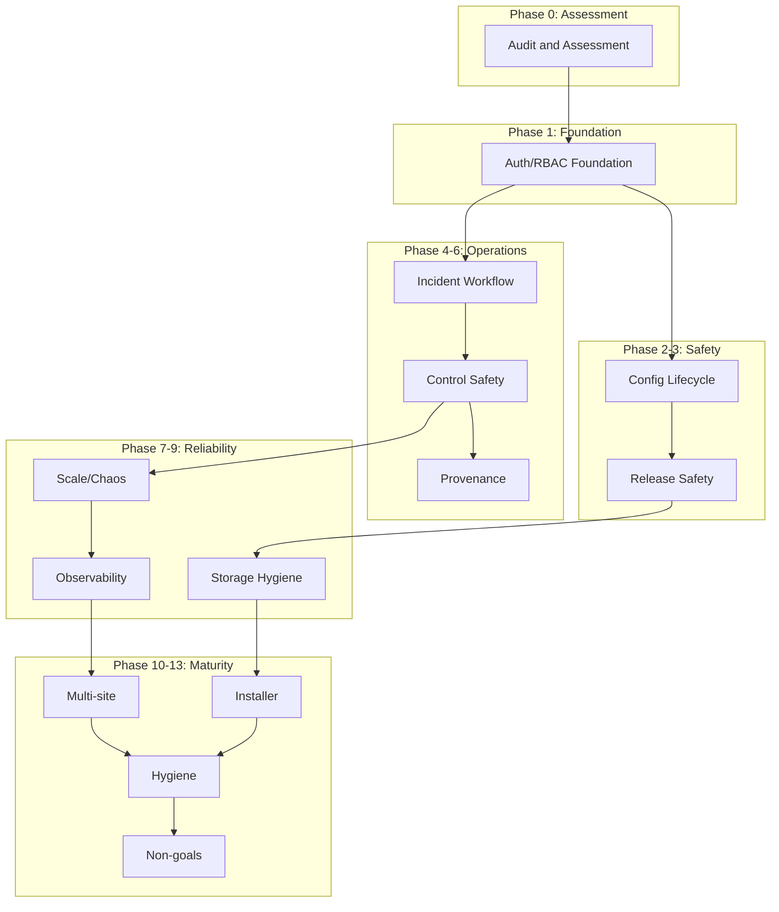

# MEL Production Closure Roadmap

**Version:** 1.0  
**Date:** March 2026  
**Status:** Draft for Review

This document sequences the remaining work to achieve production maturity. Each phase builds upon previous phases with explicit dependencies, scope boundaries, and verification requirements.

> **Terminology:** "Closure" means bringing a capability to a well-defined, documented, and verified state—not necessarily feature-complete, but honest about boundaries.

---

## Phase 0: Audit and Assessment

**Status:** IN PROGRESS

| Attribute | Details |
|-----------|---------|
| **Objective** | Establish baseline truth about current capabilities |
| **Why now** | Cannot plan closure without knowing current state |
| **Dependencies** | None |

### In-scope
- Code review of all major subsystems
- Documentation audit against code reality
- Maturity matrix creation (this artifact)
- Gap identification and prioritization

### Out-of-scope
- Code changes
- New features
- Performance optimization

### Code surfaces touched
- All documentation files
- Configuration schemas
- API surface review

### Data model impact
None

### API/UI/CLI impact
None

### Risk if skipped
- Misaligned priorities
- Resources wasted on wrong problems
- False confidence in production readiness

### Verification requirements
- [ ] Maturity matrix reviewed by code owners
- [ ] All classifications have file references
- [ ] Gap list prioritized by impact

### Definition of done
- [ ] PRODUCTION_MATURITY_MATRIX.md completed
- [ ] All 33 assessment areas classified
- [ ] Critical gaps identified with rationale

---

## Phase 1: Auth/RBAC Foundation

**Status:** NOT STARTED

| Attribute | Details |
|-----------|---------|
| **Objective** | Establish multi-operator identity and authorization model |
| **Why now** | Single shared credential blocks multi-operator use; action attribution requires identity |
| **Dependencies** | Phase 0 complete |

### In-scope
- User database schema
- Password hashing (bcrypt)
- Session management with JWT
- Basic RBAC roles: `viewer`, `operator`, `admin`
- Role-based API access control
- CLI user management commands

### Out-of-scope
- OIDC/SAML integration
- Multi-factor authentication
- Fine-grained permissions (resource-level)
- User groups/teams

### Code surfaces touched
- [`internal/config/config.go`](internal/config/config.go:38) - AuthConfig expansion
- [`internal/web/web.go`](internal/web/web.go:853) - withAuth middleware rewrite
- [`migrations/`](migrations/) - Users and sessions tables
- [`cmd/mel/main.go`](cmd/mel/main.go:100) - User management commands
- [`frontend/src/`](frontend/src/) - Login flow, role-aware UI

### Data model impact
```sql
-- New tables
users (id, username, password_hash, role, created_at, updated_at)
sessions (id, user_id, token, expires_at, created_at)
-- Modify control_actions to include user_id
```

### API/UI/CLI impact
- API: Bearer token auth replaces basic auth
- API: 403 responses for permission denied
- UI: Login page; role-based menu visibility
- CLI: `mel user add`, `mel user list`, `mel user remove`

### Risk if skipped
- Cannot attribute actions to operators
- No audit trail for compliance
- Shared credential security risk
- Blocks multi-tenancy considerations

### Verification requirements
- [ ] Unit tests for password hashing
- [ ] Integration tests for role-based access
- [ ] Security review of token handling
- [ ] Documentation of role permissions

### Definition of done
- [ ] Users can authenticate with username/password
- [ ] Sessions expire correctly
- [ ] API enforces role-based access
- [ ] UI adapts to user role
- [ ] All actions attributed to users in audit log

---

## Phase 2: Config Lifecycle and Drift Safety

**Status:** NOT STARTED

| Attribute | Details |
|-----------|---------|
| **Objective** | Make configuration changes visible, auditable, and recoverable |
| **Why now** | Config drift is a major source of production issues |
| **Dependencies** | Phase 1 (for action attribution) |

### In-scope
- Config version tracking
- Effective config export (showing env overrides)
- Config change audit trail
- Config drift detection
- Config validation hooks
- Hot reload for non-critical settings

### Out-of-scope
- Distributed config (etcd/consul)
- Config templating
- Secret management integration

### Code surfaces touched
- [`internal/config/config.go`](internal/config/config.go:200) - Config versioning
- [`internal/db/db.go`](internal/db/db.go:1) - Config history table
- [`cmd/mel/main.go`](cmd/mel/main.go:157) - Config audit commands
- [`internal/web/web.go`](internal/web/web.go:1) - Config API endpoints

### Data model impact
```sql
config_versions (id, config_json, source, changed_by, created_at)
config_effective (snapshot with env overrides resolved)
```

### API/UI/CLI impact
- API: `GET /api/v1/config/effective`
- API: `GET /api/v1/config/history`
- UI: Config diff viewer
- CLI: `mel config history`, `mel config diff`

### Risk if skipped
- Undetected config drift
- Cannot reproduce issues across environments
- Changes not attributed to operators
- Environment-specific issues hard to debug

### Verification requirements
- [ ] Config changes logged with user attribution
- [ ] Effective config shows merged values
- [ ] Drift detection alerts on mismatch
- [ ] Rollback to previous config works

### Definition of done
- [ ] Every config change is auditable
- [ ] Effective config can be exported
- [ ] Drift detection operational
- [ ] Documentation of config precedence rules

---

## Phase 3: Release Safety and Upgrade Path

**Status:** NOT STARTED

| Attribute | Details |
|-----------|---------|
| **Objective** | Make upgrades safe, reversible, and low-downtime |
| **Why now** | Production deployments require confidence in upgrade path |
| **Dependencies** | Phase 2 (for config versioning) |

### In-scope
- Automated backup before upgrade
- Schema migration dry-run capability
- Version compatibility checking
- Rollback automation
- Health-check gates during upgrade
- Upgrade documentation

### Out-of-scope
- Zero-downtime upgrades (blue/green)
- Rolling upgrades
- Canary deployments

### Code surfaces touched
- [`cmd/mel/main.go`](cmd/mel/main.go:81) - Backup integration
- [`internal/db/db.go`](internal/db/db.go:74) - Migration dry-run
- [`internal/version/version.go`](internal/version/version.go:1) - Version compatibility
- Release scripts

### Data model impact
```sql
schema_migrations enhancements for rollback support
version_checkpoints (for upgrade recovery)
```

### API/UI/CLI impact
- CLI: `mel upgrade check` - compatibility check
- CLI: `mel upgrade --dry-run`
- CLI: `mel rollback` (restore + downgrade schema)

### Risk if skipped
- Failed upgrades leave system broken
- Data loss during upgrade
- No recovery path
- Operators fear upgrading

### Verification requirements
- [ ] Automated backup before schema change
- [ ] Rollback tested in CI
- [ ] Version compatibility matrix maintained
- [ ] Upgrade documentation validated

### Definition of done
- [ ] Upgrades have automated pre-flight checks
- [ ] Rollback path tested and documented
- [ ] Data loss prevention verified
- [ ] Release notes include migration guide

---

## Phase 4: Incident Workflow and Alert Lifecycle

**Status:** NOT STARTED

| Attribute | Details |
|-----------|---------|
| **Objective** | Make alerts actionable, trackable, and manageable |
| **Why now** | Current alerts are fire-and-forget; operators need workflow |
| **Dependencies** | Phase 1 (for user attribution) |

### In-scope
- Alert acknowledgment workflow
- Alert suppression rules
- Alert correlation (grouping related issues)
- Notification channels (webhook, email)
- Alert escalation
- Incident timeline view

### Out-of-scope
- PagerDuty/OpsGenie native integration
- ML-based alert correlation
- Automatic remediation (covered in Phase 5)

### Code surfaces touched
- [`internal/db/db.go`](internal/db/db.go:1) - Alert state tables
- [`internal/web/web.go`](internal/web/web.go:81) - Alert API endpoints
- [`internal/alerts/`](internal/alerts/) - New package
- [`frontend/src/pages/`](frontend/src/pages/) - Alert management UI
- [`cmd/mel/main.go`](cmd/mel/main.go:1) - Alert CLI commands

### Data model impact
```sql
alerts (id, type, severity, message, source, created_at, acknowledged_by, acknowledged_at, resolved_at)
alert_suppression_rules (id, pattern, duration, created_by)
incidents (id, alert_ids, status, timeline_json)
notification_channels (id, type, config)
```

### API/UI/CLI impact
- API: `POST /api/v1/alerts/{id}/acknowledge`
- API: `POST /api/v1/alerts/{id}/resolve`
- API: Alert filtering and search
- UI: Alert inbox with acknowledgment
- UI: Incident timeline
- CLI: `mel alerts list`, `mel alerts ack`, `mel alerts resolve`

### Risk if skipped
- Alert fatigue
- Missed critical alerts
- No incident history for postmortems
- Cannot measure MTTR

### Verification requirements
- [ ] Alert acknowledgment prevents escalation
- [ ] Suppression rules work without hiding real issues
- [ ] Notifications delivered reliably
- [ ] Incident timeline accuracy

### Definition of done
- [ ] Alert acknowledgment workflow operational
- [ ] Suppression rules configurable
- [ ] At least one notification channel (webhook)
- [ ] Incident timeline viewable

---

## Phase 5: Control Safety Capstone

**Status:** NOT STARTED

| Attribute | Details |
|-----------|---------|
| **Objective** | Make control plane safe for guarded_auto operation |
| **Why now** | Current 3 advisory-only actions limit automation value |
| **Dependencies** | Phase 1 (for attribution), Phase 4 (for alert correlation) |

### In-scope
- Implement remaining control actuators
- Operator override mechanism
- Automatic rollback on failure detection
- Control simulation mode (dry-run)
- Blast radius verification
- Action rate limiting per operator

### Out-of-scope
- ML-based control decisions
- Predictive control
- Cross-mesh control orchestration

### Code surfaces touched
- [`internal/control/control.go`](internal/control/control.go:1) - Actuator implementations
- [`internal/service/app.go`](internal/service/app.go:46) - Control queue handling
- [`internal/web/web.go`](internal/web/web.go:99) - Control API
- [`frontend/src/pages/Control.tsx`](frontend/src/pages/Control.tsx:1) - Control UI

### Data model impact
```sql
-- Enhance control_actions with operator_id
-- Add control_simulations table for dry-run results
```

### API/UI/CLI impact
- API: `POST /api/v1/control/actions` with simulation flag
- API: `POST /api/v1/control/actions/{id}/cancel`
- UI: Control simulation button
- UI: Active actions with cancel option
- CLI: `mel control simulate`

### Risk if skipped
- Control plane remains advisory-only
- Manual intervention required for common issues
- Value proposition limited

### Verification requirements
- [ ] All actions have working actuators
- [ ] Override works within SLA
- [ ] Rollback completes successfully
- [ ] Simulation matches real behavior

### Definition of done
- [ ] All 8 control actions executable
- [ ] Operator override functional
- [ ] Automatic rollback on failure
- [ ] Simulation mode accurate

---

## Phase 6: Provenance and Evidence Integrity

**Status:** NOT STARTED

| Attribute | Details |
|-----------|---------|
| **Objective** | Make decisions traceable and evidence tamper-evident |
| **Why now** | Compliance and debugging require trustworthy audit trails |
| **Dependencies** | Phase 1 (for attribution), Phase 5 (for control actions) |

### In-scope
- Evidence linking (decision → source data)
- Audit log signing
- Append-only audit enforcement
- Evidence hash chain
- Export with proof of integrity

### Out-of-scope
- Blockchain anchoring
- Third-party attestation
- Legal hold workflows

### Code surfaces touched
- [`internal/db/db.go`](internal/db/db.go:1) - Audit enhancements
- [`internal/control/control.go`](internal/control/control.go:118) - Evidence linking
- [`internal/support/support.go`](internal/support/support.go:1) - Signed exports
- [`internal/crypto/crypto.go`](internal/crypto/crypto.go:1) - Cryptographic utilities

### Data model impact
```sql
audit_logs enhancements:
  - previous_hash (for chain)
  - signature
  - evidence_refs JSON

evidence_links (decision_id, source_table, source_id, hash)
```

### API/UI/CLI impact
- API: `GET /api/v1/audit/verify` - verify chain integrity
- UI: Decision detail with evidence links
- CLI: `mel audit verify`

### Risk if skipped
- Audit logs can be repudiated
- Decisions cannot be verified
- Compliance requirements not met
- Debugging hampered by unclear causality

### Verification requirements
- [ ] Audit chain validates
- [ ] Evidence links resolve correctly
- [ ] Tampering detection works
- [ ] Export includes verification data

### Definition of done
- [ ] Audit log is tamper-evident
- [ ] Every decision links to evidence
- [ ] Evidence integrity verifiable
- [ ] Documentation of verification process

---

## Phase 7: Scale and Chaos Readiness

**Status:** NOT STARTED

| Attribute | Details |
|-----------|---------|
| **Objective** | Verify behavior under load and failure conditions |
| **Why now** | Production traffic patterns differ from test environments |
| **Dependencies** | Phase 5 (control stability) |

### In-scope
- Load testing framework
- Chaos engineering (failure injection)
- Performance profiling
- Bottleneck identification
- Capacity planning guidance

### Out-of-scope
- Horizontal scaling
- Database sharding
- CDN integration

### Code surfaces touched
- [`internal/transport/`](internal/transport/) - Load handling
- [`internal/db/db.go`](internal/db/db.go:138) - Query optimization
- [`internal/service/app.go`](internal/service/app.go:77) - Queue tuning
- New `testing/chaos/` package

### Data model impact
```sql
performance_metrics (timestamp, metric_name, value, labels_json)
```

### API/UI/CLI impact
- CLI: `mel load-test` (development only)
- API: Metrics endpoint enhancements
- UI: Performance dashboard

### Risk if skipped
- Unknown breaking points
- Production incidents from load spikes
- Cannot commit to SLAs

### Verification requirements
- [ ] Load tests pass at documented limits
- [ ] Chaos experiments have expected outcomes
- [ ] Performance regression detected in CI
- [ ] Capacity limits documented

### Definition of done
- [ ] Load testing framework exists
- [ ] Chaos tests cover critical paths
- [ ] Performance baselines established
- [ ] Scaling limits documented

---

## Phase 8: Storage Hygiene and Recovery

**Status:** NOT STARTED

| Attribute | Details |
|-----------|---------|
| **Objective** | Make storage reliable, self-maintaining, and recoverable |
| **Why now** | Storage issues are critical path; current gaps risk data loss |
| **Dependencies** | Phase 3 (backup/restore foundation) |

### In-scope
- Automatic background pruning
- Size-based retention
- Corruption detection and alerting
- Repair automation
- Point-in-time recovery
- Actual restore implementation (not dry-run)

### Out-of-scope
- Multi-region replication
- Object storage offload
- Compression at rest

### Code surfaces touched
- [`internal/db/retention.go`](internal/db/retention.go:1) - Enhanced pruning
- [`internal/db/db.go`](internal/db/db.go:74) - Corruption checks
- [`internal/backup/backup.go`](internal/backup/backup.go:1) - Restore implementation
- [`cmd/mel/main.go`](cmd/mel/main.go:121) - Restore command

### Data model impact
```sql
storage_health (check_time, integrity_status, details)
backup_manifest (id, created_at, checksum, size, tables_included)
```

### API/UI/CLI impact
- CLI: `mel backup restore` (actual restore)
- CLI: `mel db check-integrity`
- API: Storage health endpoint
- UI: Storage management dashboard

### Risk if skipped
- Disk exhaustion
- Data corruption unnoticed
- Cannot recover from failures
- Manual maintenance burden

### Verification requirements
- [ ] Pruning prevents unbounded growth
- [ ] Corruption detection catches injected errors
- [ ] Restore recovers data correctly
- [ ] Recovery time documented

### Definition of done
- [ ] Automatic pruning operational
- [ ] Corruption detection enabled
- [ ] Full restore tested and documented
- [ ] Storage health visible in UI

---

## Phase 9: Self-Observability and SLO Truth

**Status:** NOT STARTED

| Attribute | Details |
|-----------|---------|
| **Objective** | Make MEL observable with defined SLOs |
| **Why now** | Cannot manage what you cannot measure |
| **Dependencies** | Phase 7 (performance baselines) |

### In-scope
- Prometheus/OpenTelemetry metrics
- SLO/SLI definitions
- Alerting on SLO violations
- Performance profiling endpoints
- Health score aggregation
- SLI dashboard

### Out-of-scope
- External APM integration (DataDog, NewRelic)
- Distributed tracing
- Log aggregation platform

### Code surfaces touched
- [`internal/web/web.go`](internal/web/web.go:68) - Metrics endpoint
- [`internal/metrics/`](internal/metrics/) - New package
- [`internal/service/app.go`](internal/service/app.go:1) - Instrumentation
- [`frontend/src/pages/`](frontend/src/pages/) - SLI dashboard

### Data model impact
```sql
sli_history (timestamp, sli_name, value, target, burn_rate)
```

### API/UI/CLI impact
- API: Prometheus exposition format
- API: `/api/v1/slis` endpoint
- UI: SLI dashboard with burn rates
- CLI: `mel metrics`

### Risk if skipped
- Flying blind on performance
- SLO violations unnoticed
- Cannot commit to reliability

### Verification requirements
- [ ] SLIs accurately reflect user experience
- [ ] SLO violations trigger alerts
- [ ] Metrics cardinality controlled
- [ ] Dashboards reviewed by operators

### Definition of done
- [ ] Core SLIs defined and measured
- [ ] SLOs documented with error budgets
- [ ] Alerting on SLO violations
- [ ] SLI dashboard operational

---

## Phase 10: Multi-site and Tenancy Boundaries

**Status:** NOT STARTED

| Attribute | Details |
|-----------|---------|
| **Objective** | Define supported topologies for distributed deployment |
| **Why now** | Early architecture decisions affect multi-site feasibility |
| **Dependencies** | Phase 1 (for identity), Phase 9 (for observability) |

### In-scope
- Multi-MEL federation concept
- Site identity and boundaries
- Data ownership markers
- Cross-site read-only aggregation
- Topology documentation

### Out-of-scope
- Full multi-tenancy
- Data replication between sites
- Global mesh view
- Cross-site control actions

### Code surfaces touched
- [`internal/config/config.go`](internal/config/config.go:17) - Site identity
- [`internal/db/db.go`](internal/db/db.go:1) - Data ownership
- [`internal/web/web.go`](internal/web/web.go:1) - Federation API

### Data model impact
```sql
site_identity (site_id, name, region, created_at)
-- Add site_id to relevant tables for ownership
```

### API/UI/CLI impact
- API: Federation endpoints
- UI: Site selector
- CLI: `mel site register`

### Risk if skipped
- Architecture prevents future scaling
- Data ownership unclear
- Multi-site deployments unsupported

### Verification requirements
- [ ] Site isolation verified
- [ ] Federation API secure
- [ ] Topology documentation accurate

### Definition of done
- [ ] Site identity established
- [ ] Federation concept documented
- [ ] Multi-site limitations explicit

---

## Phase 11: Installer and Bootstrap Ergonomics

**Status:** NOT STARTED

| Attribute | Details |
|-----------|---------|
| **Objective** | Make installation and setup frictionless |
| **Why now** | First impression affects adoption; setup errors cause support burden |
| **Dependencies** | Phase 3 (for safe defaults), Phase 8 (for storage setup) |

### In-scope
- Docker official image
- Kubernetes deployment manifests
- Cloud-init support
- Windows installer
- Interactive setup wizard
- Post-install verification

### Out-of-scope
- Managed service offering
- Marketplace integrations
- Helm chart complexity

### Code surfaces touched
- `Dockerfile`
- `k8s/` manifests
- [`cmd/mel/main.go`](cmd/mel/main.go:45) - Init wizard
- [`docs/ops/`](docs/ops/) - Installation guides

### Data model impact
None

### API/UI/CLI impact
- CLI: `mel init --interactive`
- CLI: `mel doctor --bootstrap`

### Risk if skipped
- Low adoption
- Setup errors in production
- Support burden

### Verification requirements
- [ ] Docker image builds and runs
- [ ] Kubernetes deployment works
- [ ] Windows installer tested
- [ ] Wizard produces valid configs

### Definition of done
- [ ] Docker image published
- [ ] Kubernetes manifests tested
- [ ] Interactive wizard available
- [ ] Platform install guides complete

---

## Phase 12: Engineering Hygiene Closure

**Status:** NOT STARTED

| Attribute | Details |
|-----------|---------|
| **Objective** | Close documentation and testing gaps |
| **Why now** | Final polish before production declaration |
| **Dependencies** | All previous phases |

### In-scope
- API documentation completeness
- Architecture decision records (ADRs)
- Code coverage improvements
- Performance benchmarks
- Security audit
- Accessibility review

### Out-of-scope
- Feature additions
- Refactoring without bug fixes

### Code surfaces touched
- All documentation
- All tests
- Security scanning

### Data model impact
None

### API/UI/CLI impact
None

### Risk if skipped
- Incomplete documentation
- Security vulnerabilities
- Technical debt accumulation

### Verification requirements
- [ ] All public APIs documented
- [ ] Code coverage >80%
- [ ] Security scan clean
- [ ] Performance benchmarks pass

### Definition of done
- [ ] Documentation complete
- [ ] Tests comprehensive
- [ ] Security audit passed
- [ ] Ready for production declaration

---

## Phase 13: Explicit Non-Goals and Limits

**Status:** NOT STARTED

| Attribute | Details |
|-----------|---------|
| **Objective** | Document what MEL explicitly does not do |
| **Why now** | Scope clarity prevents misalignment |
| **Dependencies** | All previous phases |

### In-scope
- Non-goals documentation
- Limitations charter
- Future directions (not commitments)
- Out-of-scope feature registry

### Out-of-scope
- Roadmap promises
- Feature commitments

### Code surfaces touched
- [`docs/product/what-mel-is-not.md`](docs/product/what-mel-is-not.md:1)
- [`docs/architecture/`](docs/architecture/)

### Data model impact
None

### API/UI/CLI impact
None

### Risk if skipped
- Scope creep
- Unrealistic expectations
- Misdirected effort

### Verification requirements
- [ ] Non-goals reviewed by stakeholders
- [ ] Limitations validated against code

### Definition of done
- [ ] Non-goals documented
- [ ] Limitations explicit
- [ ] Future directions scoped

---

## Roadmap Visualization



---

## Execution Notes

### Parallel Work
Phases 2 and 4 can proceed in parallel after Phase 1. Phases 7-9 have some overlap but should generally be sequential.

### Exit Criteria
Before declaring production ready:
1. All phases through 9 complete
2. Minimum 2 weeks production-like soak testing
3. Incident response runbook tested
4. Rollback tested under load

### Maintenance Mode
After Phase 12, MEL enters maintenance mode where:
- New features require architectural review
- Focus shifts to stability and performance
- Documentation kept in sync with code
