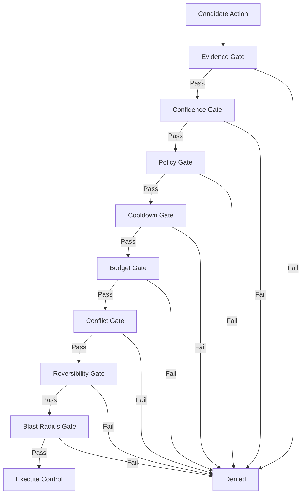

# MEL Control Plane: Architecture & Guardrails

The MEL Control Plane is responsible for remediation and mesh-tuning actions. It operates under a "Guarded Automation" philosophy, ensuring that no action is taken without verified evidence, sufficient confidence, and clear reversibility.

---

## Control Modes

MEL supports three operational modes for the Control Plane:

| Mode | Description |
| :--- | :--- |
| **`disabled`** | No candidate actions are even generated. The control plane is dormant. |
| **`advisory`** | Candidate actions are generated and evaluated, but never executed. They appear in the UI as "suggestions" or "denied by mode". |
| **`guarded_auto`** | Actions that pass all safety checks and meet the confidence threshold are executed automatically. |

---

## Approval gate (multi-operator)

Some actions are configured to require **explicit operator approval** before they may run (`control.require_approval_for_action_types`, `control.require_approval_for_high_blast_radius`). Those actions are persisted in `pending_approval`, capture an **evidence bundle** at proposal time, and transition to `pending` only after `ApproveAction` succeeds.

**Enforcement:** the executor refuses to run any action whose `execution_mode` is `approval_required` while `lifecycle_state` is still `pending_approval` (even if a stale copy were injected into the queue).

**HTTP:** `POST /api/v1/actions/{id}/approve` and `.../reject` require the `approve_control_action` capability. Actor attribution uses the authenticated `security.Identity`; when `auth.enabled` is true you may also send `X-Operator-ID` to record a human-readable operator label in durable audit rows.

**CLI:** use `mel action approve|reject` for the full service path (RBAC audit + timeline + queue). `mel control approve|reject` updates SQLite only and should be treated as a break-glass / offline path.

---

## The Reality Matrix

Not all actions are created equal. MEL maintains an internal "Reality Matrix" that defines the capabilities and safety profile of every possible action.

| Action | Actuator Status | Reversible | Blast Radius | Notes |
| :--- | :--- | :--- | :--- | :--- |
| `restart_transport` | ✅ Verified | Yes | Local | Restarts the specific transport worker to clear transient stalls. |
| `resubscribe` | ✅ Verified | Yes | Local | Force-refreshes MQTT subscriptions or Serial handshakes. |
| `backoff_increase` | ✅ Verified | Yes | Local | Increases reconnection backoff during high-frequency failure storms. |
| `backoff_reset` | ✅ Verified | Yes | Local | Restores backoff to baseline levels. |
| `deprioritize` | ⚠️ Advisory | No | Mesh-edge | MEL suggests deprioritization, but routing remains manual. |
| `suppress_source` | ⚠️ Advisory | No | Mesh-wide | Suppression is a high-gravity action and requires manual operator approval. |

---

## Safety Guardrails (The 8-Point Check)

Before an action moves from "Candidate" to "Executed", it must pass eight distinct safety layers:

1. **Evidence Pass**: PERSISTED evidence must exist in SQLite for at least 2 distinct time buckets. No "flapping" reactions.
2. **Confidence Pass**: The Intelligence Layer must report a confidence score above the user-defined threshold (default 90%).
3. **Policy Pass**: The action type must be explicitly allowed in `mel.json`.
4. **Cooldown Pass**: The same target (transport/node) must not have had an action in the last `cooldown_period`.
5. **Budget Pass**: The total number of actions in the current window must not exceed the configured capacity.
6. **Conflict Pass**: No other in-flight action can target the same resource.
7. **Reversibility Pass**: The action must be either intrinsically reversible or have a deterministic expiry.
8. **Blast Radius Pass**: The predicted impact must be bounded to the local node or transport.

---

## Decision Integrity

Every decision is recorded in the `control_decisions` table with a unique `DecisionID`. This ledger includes:

- **Safety Check Vector**: A bitmask of passed/failed checks.
- **Trigger Evidence**: The specific anomalies or metrics that triggered the candidate.
- **Attribution**: Evidence for which node or transport is responsible for the failure.

*MEL — Decision Infrastructure for Meshtastic.*
