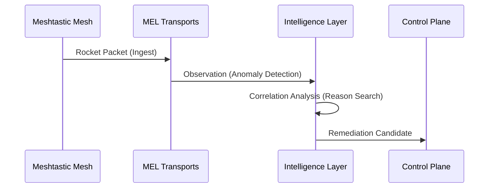

# MEL Intelligence Layer: Correlation & Inference

The Intelligence Layer is the "brain" of MEL. It doesn't just collect data—it correlates failures across transports, estimates the blast radius of anomalies, and identifies root causes.

---

## Unidirectional Correlation

MEL performs **Unidirectional Correlation** across all enabled transports:

1. **Ingest Pulse**: Every packet received by a transport is timestamped and bucketed.
2. **Anomaly Detection**: Transports report "Observations" and "Failures" (e.g., `TIMEOUT`, `MALFORMED`).
3. **Cross-Transport Synthesis**: MEL's Intelligence Layer looks for a "Reason Correlation" across multiple transports (e.g., *Timeout* occurring on both Serial and MQTT simultaneously).

---

## Root Cause Analysis (RCA)

MEL identifies the "Primary Cause" of mesh degradation by weighting evidence:

| Evidence Type | Signal | Diagnosis |
| :--- | :--- | :--- |
| **Coincident Timeout** | Universal Signal | Connectivity Issue (Global) |
| **Observation Drops** | Saturation Signal | Ingest Pressure (Local) |
| **Repeated Handshake** | Reset Signal | Node Flapping / Poor Signal |
| **Payload Malform** | Integrity Signal | Protocol Mismatch / Interference |

---

## Mesh Segments

MEL divides its observability into "Segments". Each segment represents a distinct part of the mesh or its connection to the host.

- **`mqtt:broker`**: Connection to the upstream MQTT server.
- **`mqtt:ingest`**: Successful packet flow from the broker.
- **`serial:node`**: Direct physical node connection.
- **`mesh:messages`**: Overall throughput of the local mesh.

When a segment is degraded, the Intelligence Layer generates **Remediation Recommendations**.

---

## Guarded Automation Confidence

Every recommendation includes a **Confidence Score** (0.0 to 1.0) derived from:

- **Evidence Diversity**: How many different transports or nodes report the same issue.
- **Temporal Consistency**: How long the anomaly has persisted across time buckets.
- **Attribution Strength**: How clearly a specific node or transport can be identified as the source.

---

## Incident Intelligence Summary (deterministic, history-backed)

MEL now attaches a typed `incident.intelligence` payload on incident list/detail APIs.  
This payload is derived from persisted evidence and does **not** claim root cause.

What MEL computes:

- deterministic **signature key** from incident category/resource/reason fields;
- persisted signature counters (`incident_signatures`) and incident/signature links;
- evidence items from incident rows, transport alerts, dead-letter reason clusters, and linked control-action outcomes;
- bounded domain hints (`transport`, `control`, `topology`) with explicit “association only” language;
- “investigate next” guidance tied to specific evidence references;
- similar prior incidents only when signature linkage exists.

What MEL does **not** compute:

- no probabilistic/ML root-cause model;
- no action auto-execution from incident intelligence;
- no causality claim from correlation;
- no “all clear” when evidence is sparse (degraded reasons are surfaced).

This keeps incident guidance explainable, replayable, and bounded by stored operator evidence history.
