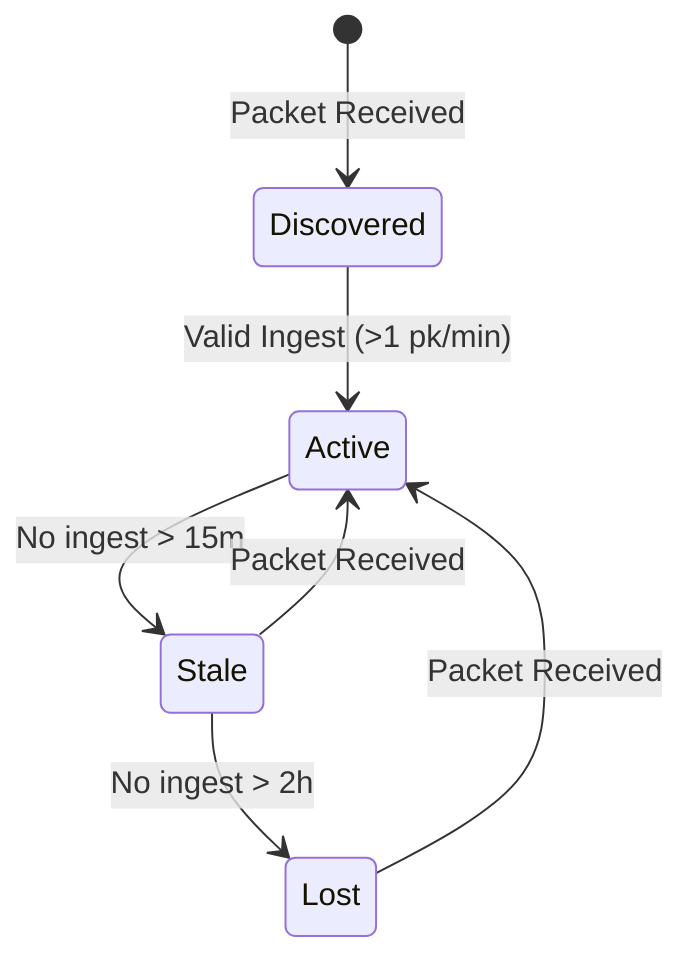

# Node Interaction & Status Lifecycle

MEL tracks the lifecycle of every node observed on the mesh. Unlike a simple "last seen" timer, MEL maintains a status matrix based on transport-specific evidence.

## Node Lifecycle

## Telemetry Evidence

MEL doesn't just display telemetry; it reconstructs the history of a node's performance.

### Key Metrics Tracked

- **Signal Quality (SNR/RSSI)**: Correlated across multiple transports if available.
- **Battery/Voltage**: Extracted from telemetry packets and bucketed for trend analysis.
- **Hop Count**: Used to estimate position in the mesh topology.
- **Message Velocity**: Frequency of user and system messages.

*MEL — Truthful Local-First Mesh Observability.*
