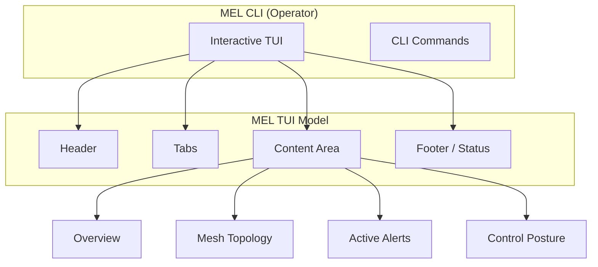

# MEL Operator TUI: Terminal-Based Control Plane

For headless or low-bandwidth environments, MEL provides a high-fidelity terminal user interface (TUI). It is built with [Bubble Tea](https://github.com/charmbracelet/bubbletea) for a fluid, reactive experience.

## TUI Architecture & Flow

## TUI Experience Vision

The TUI maintains a "Retro-Futurist" technical aesthetic to ensure clarity and high-contrast legibility in terminal environments.

## Navigation Shortcuts

| Key | Action |
| :--- | :--- |
| **`Tab`** / **`→`** | Advance to the next tab. |
| **`←`** | Go back to the previous tab. |
| **`1`** - **`6`** | Jump directly to a specific tab. |
| **`R`** | Manually refresh all data segments. |
| **`P`** | Toggle automatic "Live Polling" (default on). |
| **`V`** | (Diagnostics tab only) Trigger a DB Vacuum. |
| **`Q`** / **`Ctrl+C`** | Exit the TUI. |

## Feature Tabs

### 1. OVERVIEW
A high-level health report of all enabled transports and their current ingest status. Displays pending alerts and recent message counts.

### 2. MESH
The "Mesh Inventory". Lists all nodes observed by MEL, their schema versions, and the reported capabilities of each transport (Send, Ingest, Inventory).

### 3. ALERTS
A focused view of all active transport-level failures, including detailed reason codes and the "First Triggered" timestamp.

### 4. CONTROL
Displays the current [Control Mode](file:///c:/Users/scott/GitHub/MEL-MeshEdgeLayer/docs/architecture/control-plane.md) and any active remediation episodes.

### 5. LOGS
Historical incident log for the current session. Shows status changes across segments and nodes.

### 6. DIAGS
Low-level system information, including memory allocation, uptime, platform details, and the physical location of the SQLite database.

*MEL — Truthful Local-First Mesh Observability.*
